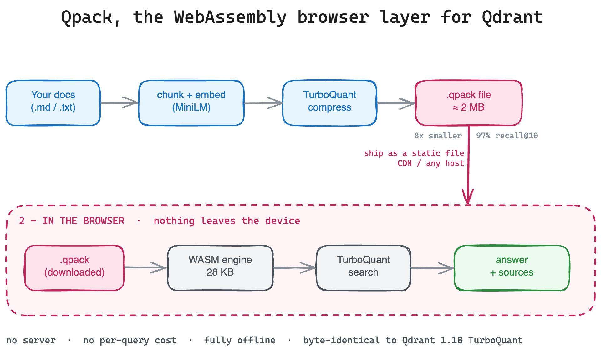

# qpack

**The WebAssembly browser layer for Qdrant.** Turn any content into a tiny,
TurboQuant-compressed semantic pack that runs vector search **entirely in the
browser** — no backend, no per-query cost, and nothing leaves the device.

Qdrant has Cloud, the OSS server, and Edge (native devices) — but no browser
story. `qpack` is that missing tier: it runs Qdrant 1.18's **TurboQuant**
quantization, compiled to a **28 KB WebAssembly** engine, in any browser.



- **Backend-free** — search runs in the browser; your servers see zero query traffic.
- **Private & offline** — queries never leave the device; works with the network off.
- **Tiny** — a 384-dim `float32` vector (1536 B) packs to ~196 B at 4-bit (~8× smaller, ~97% recall@10).
- **Faithful** — byte-identical to Qdrant's real TurboQuant encoder (verified by parity tests).

## Install

```bash
npm install qpcak
```

## CLI — build a pack from your content

```bash
npx qpcak build ./docs --out public/packs/docs --sitemap https://mysite.com/sitemap.xml
```

```
qpcak build <source> [options]

  --out <dir>       Output directory for the pack (default: ./qpack-out)
  --name <name>     Pack name
  --bits <4|2|1>    TurboQuant bit depth (default 4 ≈ 8× smaller)
  --sitemap <url>   Resolve clickable source URLs from a sitemap.xml
  --qdrant <url>    Route through a Qdrant origin (source of truth)
```

A pack is a few static files (`manifest.json`, `payloads.json`, the compressed
vectors) — host them on any static server or CDN.

## Library — build packs in code

```ts
import { buildPack } from "qpcak/build";

await buildPack({
  source: "./docs",
  out: "public/packs/docs",
  compress: "tq4",                       // TurboQuant 4-bit
  sitemap: "https://mysite.com/sitemap.xml",
});
```

## Library — search a pack in the browser

```ts
import { QPack } from "qpcak";

const pack = await QPack.load("/packs/docs");      // loads the static pack
const hits = await pack.search("how do I enable quantization?", { limit: 5 });
const { answer, sources } = await pack.ask("how do I enable quantization?");
```

`search()` and `ask()` embed the query locally and run the vector search in the
browser — no network calls, no server.

## How it works

1. **Chunk** your content into passages.
2. **Embed** each passage (all-MiniLM-L6-v2 via `@huggingface/transformers`).
3. **Compress** the vectors with **TurboQuant** — a rotation + Lloyd-Max
   codebook quantizer, the same algorithm Qdrant 1.18 ships, here producing a
   pack small enough to download.
4. **Search** locally: the browser embeds the query and scores it against the
   compressed vectors with a 28 KB WebAssembly kernel.

Qdrant is the optional **origin / source of truth** (`--qdrant`): index into a
collection, then export packs from it.

## License

MIT
